# PlotOps Architecture Documentation

This document provides comprehensive visual documentation of the PlotOps film production ERP system architecture, including system diagrams, data flows, and component relationships.

## 🏗️ System Architecture Overview

### High-Level Architecture

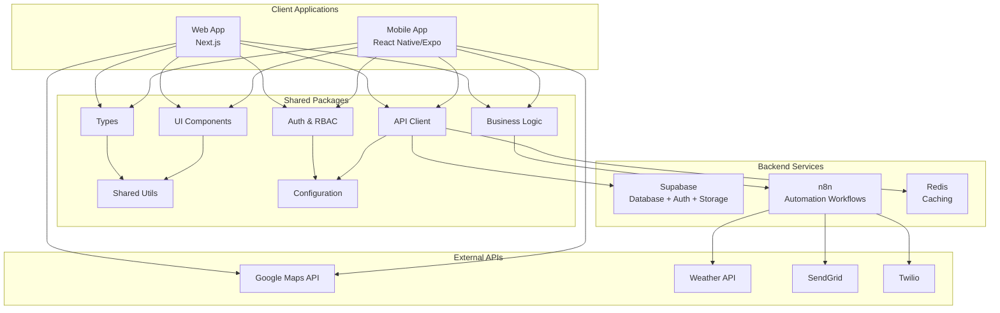

### Monorepo Structure

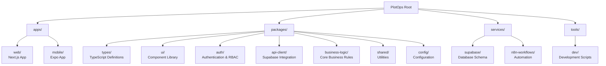

## 🎭 Role-Based Access Control (RBAC)

### User Roles and Permissions Matrix

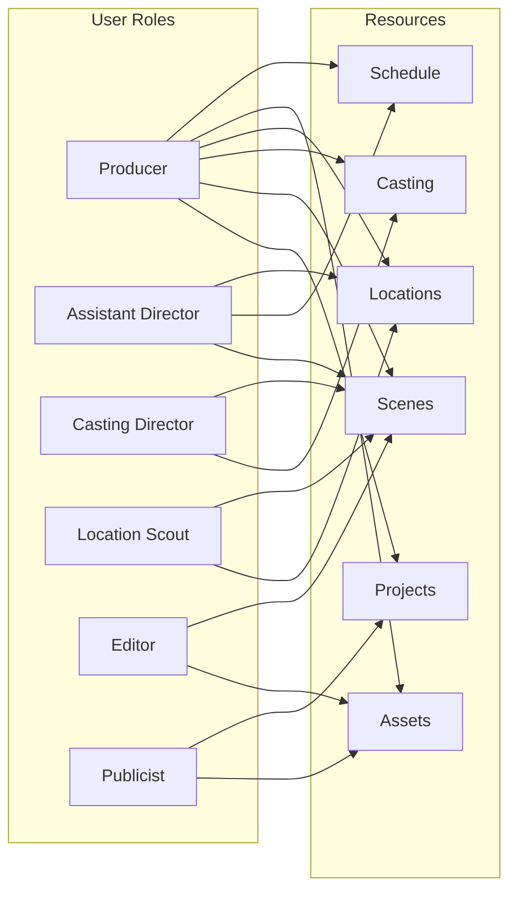

### Permission Levels

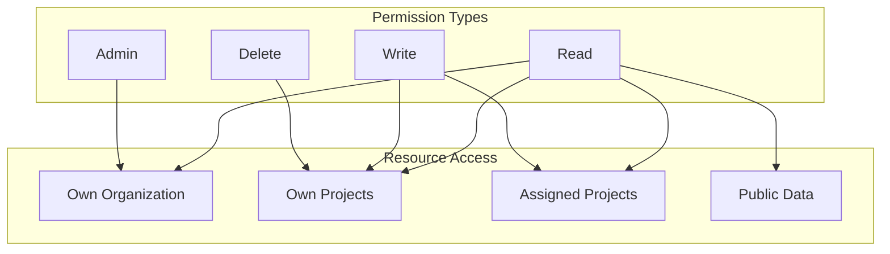

## 🗄️ Database Architecture

### Entity Relationship Diagram

```mermaid
erDiagram
    ORGANIZATIONS {
        uuid id PK
        string name
        string slug UK
        text description
        string logo_url
        jsonb settings
        timestamp created_at
        timestamp updated_at
    }
    
    USER_PROFILES {
        uuid id PK, FK
        uuid organization_id FK
        enum role
        string first_name
        string last_name
        string display_name
        text bio
        string avatar_url
        jsonb preferences
        boolean is_active
        timestamp created_at
        timestamp updated_at
    }
    
    PROJECTS {
        uuid id PK
        uuid organization_id FK
        string title
        string slug
        text logline
        text synopsis
        string genre
        enum status
        string budget_range
        date start_date
        date end_date
        string script_url
        jsonb metadata
        uuid created_by FK
        timestamp created_at
        timestamp updated_at
    }
    
    SCENES {
        uuid id PK
        uuid project_id FK
        string scene_number
        string scene_name
        string location_name
        enum scene_type
        enum time_of_day
        decimal page_count
        text description
        integer estimated_duration
        integer complexity_rating
        boolean is_pickup
        timestamp created_at
        timestamp updated_at
    }
    
    CHARACTERS {
        uuid id PK
        uuid project_id FK
        string name
        text description
        string age_range
        string gender
        string character_type
        text wardrobe_notes
        text makeup_notes
        timestamp created_at
        timestamp updated_at
    }
    
    LOCATIONS {
        uuid id PK
        uuid project_id FK
        string name
        text address
        point coordinates
        string location_type
        enum status
        string contact_name
        decimal cost_per_day
        text availability_notes
        boolean permits_required
        text[] photos
        timestamp created_at
        timestamp updated_at
    }
    
    CASTING_CALLS {
        uuid id PK
        uuid project_id FK
        uuid character_id FK
        string title
        text description
        text requirements
        enum status
        timestamp submission_deadline
        boolean is_public
        timestamp created_at
        timestamp updated_at
    }
    
    ACTORS {
        uuid id PK
        string first_name
        string last_name
        string stage_name
        string email
        string phone
        string headshot_url
        string reel_url
        string union_status
        text[] special_skills
        timestamp created_at
        timestamp updated_at
    }
    
    ORGANIZATIONS ||--o{ USER_PROFILES : "has members"
    ORGANIZATIONS ||--o{ PROJECTS : "owns"
    PROJECTS ||--o{ SCENES : "contains"
    PROJECTS ||--o{ CHARACTERS : "has"
    PROJECTS ||--o{ LOCATIONS : "uses"
    PROJECTS ||--o{ CASTING_CALLS : "posts"
    CHARACTERS ||--o{ CASTING_CALLS : "for role"
    CASTING_CALLS ||--o{ ACTORS : "receives submissions"
    USER_PROFILES ||--o{ PROJECTS : "created by"
```

### Data Flow Architecture

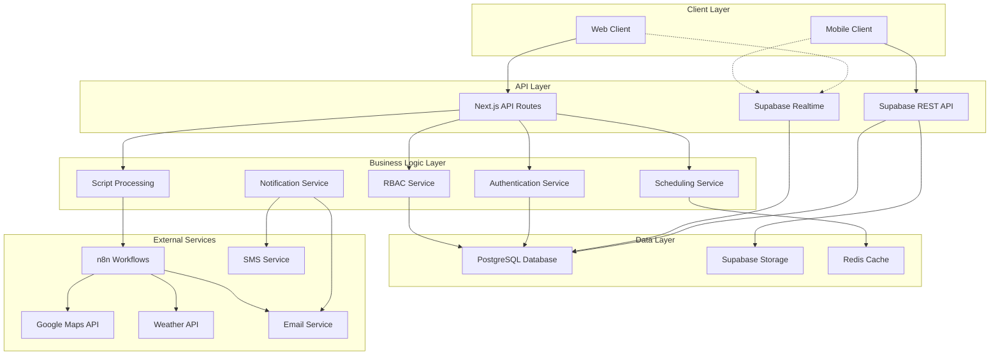

## 🎬 Film Production Workflows

### Script Ingestion and Breakdown Workflow

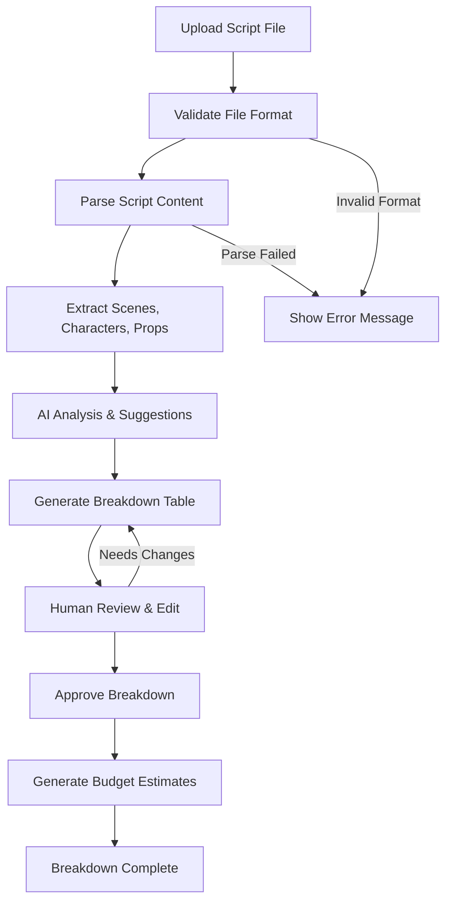

### Casting Management Workflow

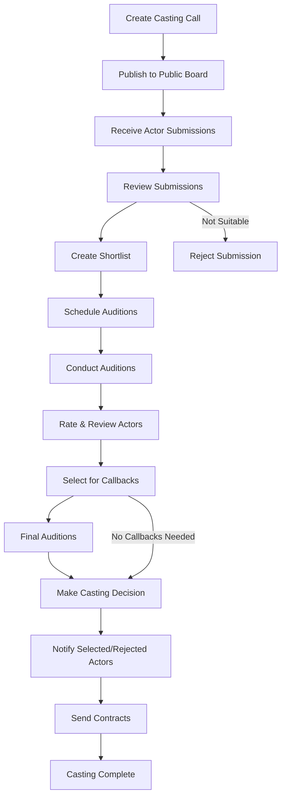

### Production Scheduling Workflow

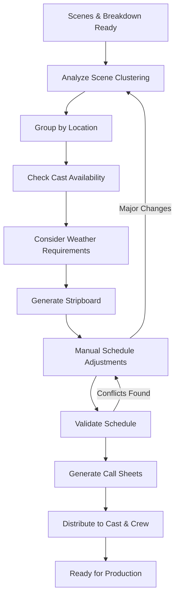

### On-Set Production Monitoring

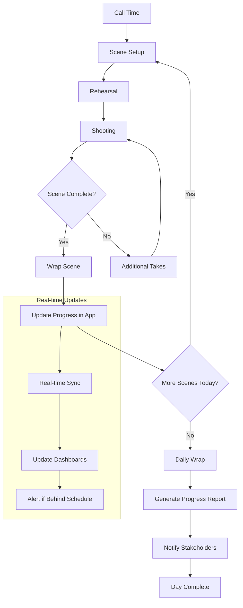

## 🔄 Automation Workflows (n8n)

### Call Sheet Generation Workflow

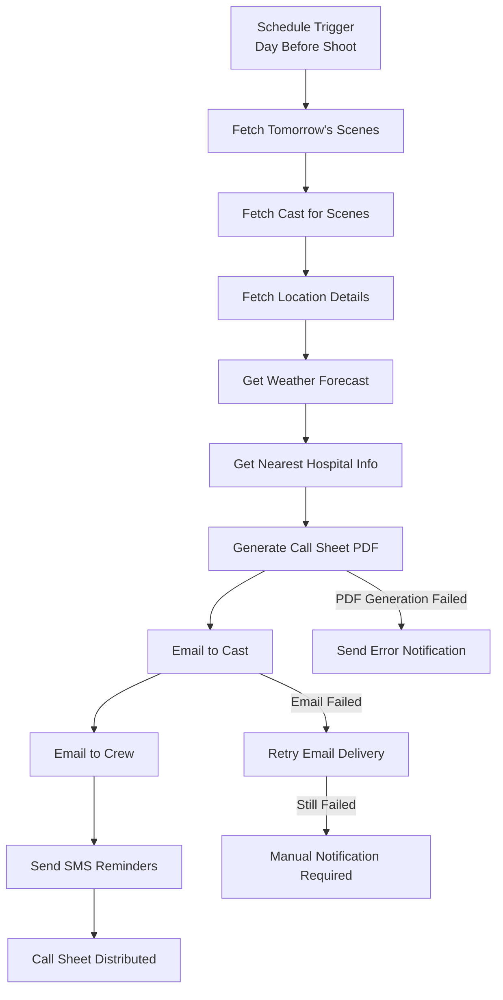

### Script Parsing Workflow

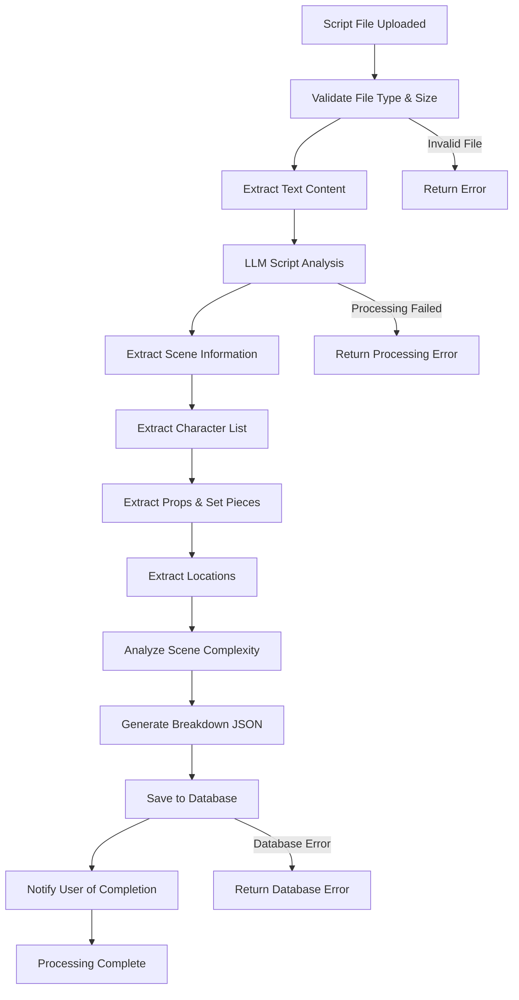

### Notification System Workflow

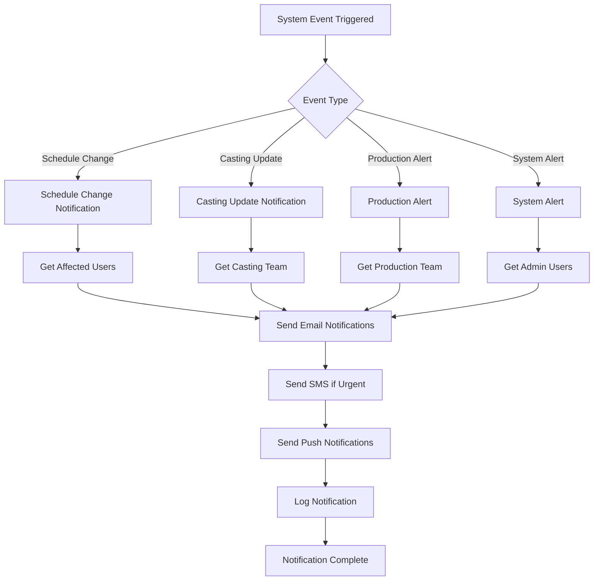

## 🔒 Security Architecture

### Authentication Flow

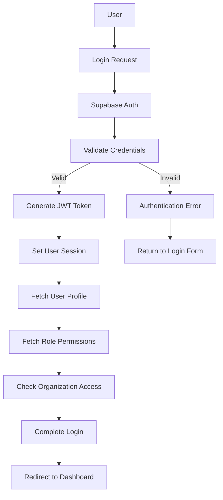

### Row Level Security (RLS) Flow

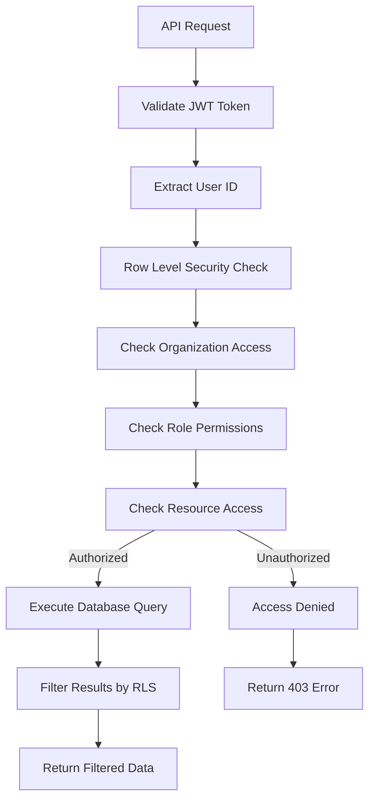

## 📱 Mobile Architecture

### React Native/Expo Architecture

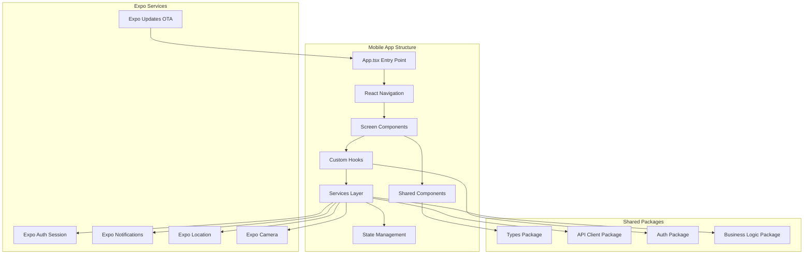

### Mobile-Specific Features

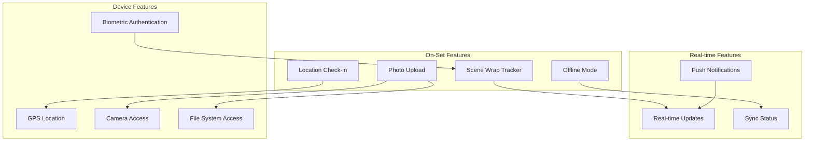

## 🚀 Deployment Architecture

### Production Deployment Flow

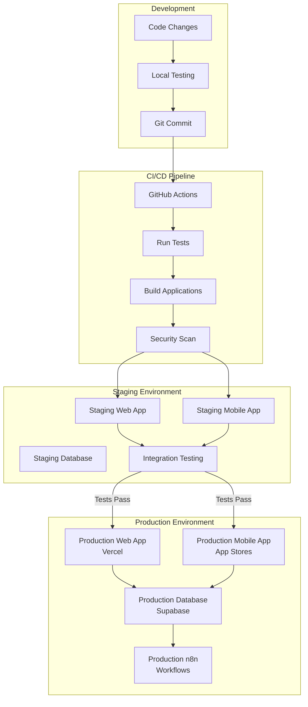

### Infrastructure Components

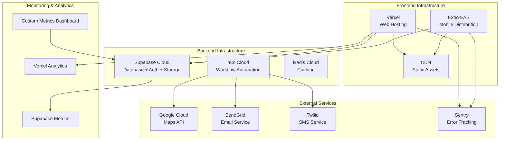

## 📊 Performance Architecture

### Caching Strategy

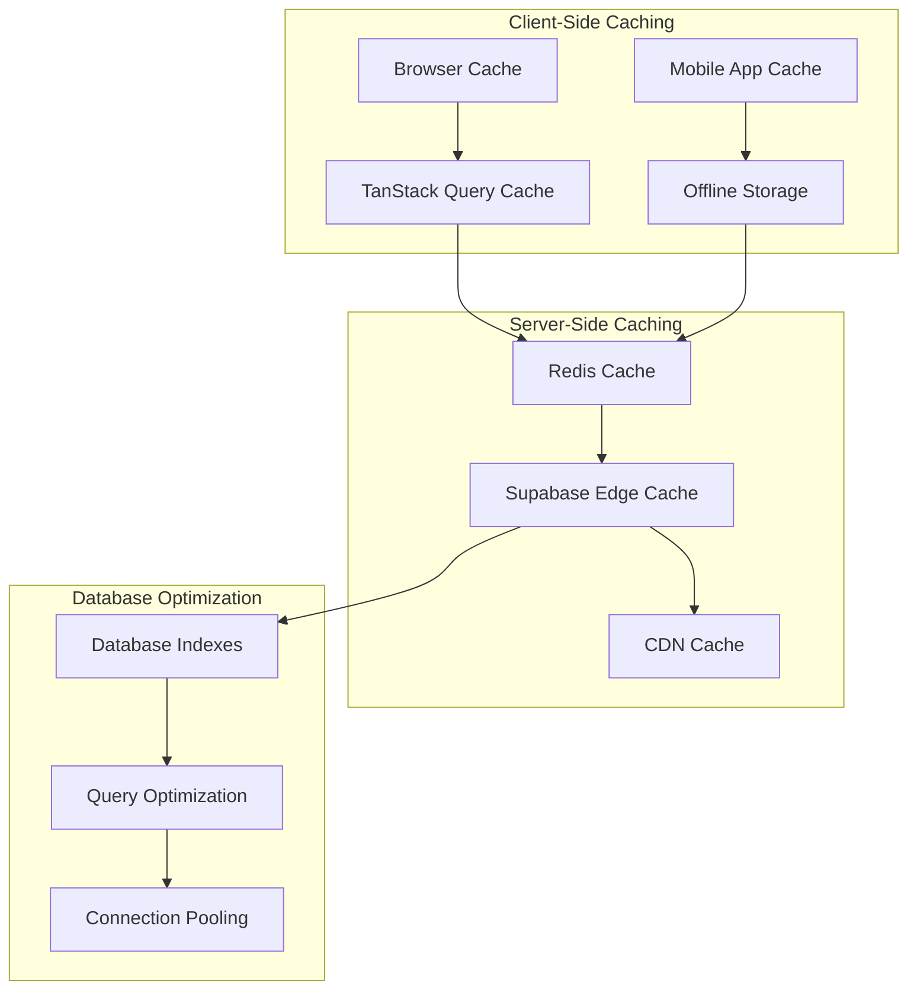

### Scalability Considerations

```mermaid
graph TD
    subgraph "Horizontal Scaling"
        LOAD_BALANCER[Load Balancer]
        MULTIPLE_INSTANCES[Multiple App Instances]
        DATABASE_REPLICAS[Database Read Replicas]
    end
    
    subgraph "Vertical Scaling"
        RESOURCE_SCALING[Resource Scaling]
        PERFORMANCE_MONITORING[Performance Monitoring]
        AUTO_SCALING[Auto Scaling]
    end
    
    subgraph "Data Scaling"
        PARTITIONING[Database Partitioning]
        ARCHIVING[Data Archiving]
        COMPRESSION[Data Compression]
    end
    
    LOAD_BALANCER --> MULTIPLE_INSTANCES
    MULTIPLE_INSTANCES --> DATABASE_REPLICAS
    
    PERFORMANCE_MONITORING --> AUTO_SCALING
    AUTO_SCALING --> RESOURCE_SCALING
    
    DATABASE_REPLICAS --> PARTITIONING
    PARTITIONING --> ARCHIVING
    ARCHIVING --> COMPRESSION
```

This architecture documentation provides a comprehensive visual overview of the PlotOps system, from high-level architecture to detailed workflow diagrams. The Mermaid diagrams help visualize complex relationships and data flows throughout the film production ERP system.