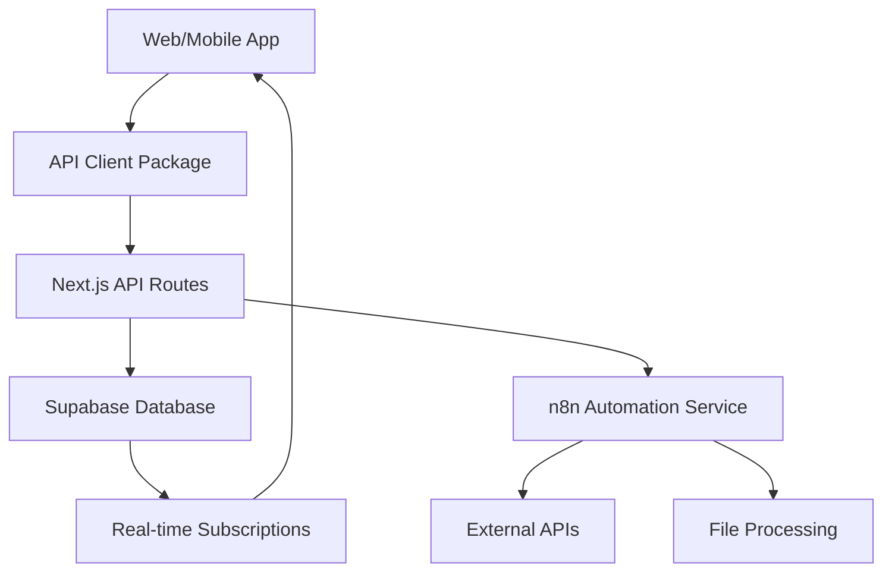
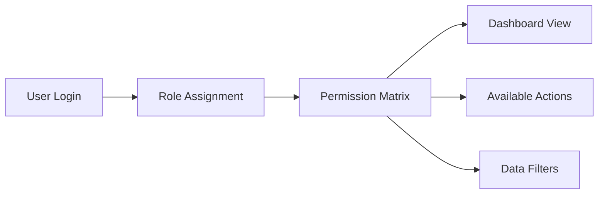

# PlotOps Monorepo Architecture Plan

## Executive Summary

This document outlines the comprehensive monorepo architecture for PlotOps, a "Cradle-to-Grave" Film Production ERP system. The architecture supports both web (Next.js) and mobile (React Native/Expo) applications with shared business logic, types, and utilities.

## Current State Analysis

**Existing Structure:**
- Single Expo/React Native application
- Basic TypeScript configuration
- Cross-platform support (iOS, Android, Web via react-native-web)
- No monorepo structure or shared packages

**Architectural Gaps Identified:**
1. No separation between web-optimized and mobile-optimized experiences
2. Missing shared package structure for business logic reuse
3. No dedicated Next.js web application for complex desktop workflows
4. Lack of proper workspace management and tooling
5. No structured approach for role-based access control
6. Missing integration patterns for Supabase and n8n

## Proposed Monorepo Architecture

### High-Level Structure

```
plotops/
├── apps/
│   ├── web/                    # Next.js web application
│   ├── mobile/                 # React Native/Expo mobile app
│   └── docs/                   # Documentation site (optional)
├── packages/
│   ├── shared/                 # Shared utilities and helpers
│   ├── types/                  # TypeScript type definitions
│   ├── ui/                     # Shared UI components
│   ├── business-logic/         # Core business logic
│   ├── api-client/            # API client and data fetching
│   ├── auth/                  # Authentication logic
│   ├── config/                # Shared configuration
│   └── database/              # Database schemas and migrations
├── services/
│   └── n8n-workflows/         # n8n automation workflows
├── tools/
│   ├── build/                 # Build tools and scripts
│   └── dev/                   # Development utilities
├── docs/                      # Architecture and API documentation
└── configs/                   # Shared configuration files
```

## Detailed Package Architecture

### 1. Applications (`apps/`)

#### Web Application (`apps/web/`)
- **Framework:** Next.js 14+ with App Router
- **Purpose:** Full-featured desktop experience
- **Key Features:**
  - Complex data visualization (Stripboard, Gantt charts)
  - File upload and processing
  - Advanced reporting and analytics
  - Multi-window workflows
  - Keyboard shortcuts and power-user features

```
apps/web/
├── src/
│   ├── app/                   # Next.js App Router
│   │   ├── (auth)/           # Auth-protected routes
│   │   ├── casting/          # Public casting board
│   │   ├── dashboard/        # Role-based dashboards
│   │   ├── projects/         # Project management
│   │   └── api/              # API routes
│   ├── components/           # Web-specific components
│   ├── hooks/               # Web-specific hooks
│   ├── lib/                 # Web utilities
│   └── styles/              # Tailwind CSS + custom styles
├── public/                  # Static assets
├── next.config.js
└── tailwind.config.js
```

#### Mobile Application (`apps/mobile/`)
- **Framework:** React Native with Expo
- **Purpose:** On-the-go production management
- **Key Features:**
  - Real-time production monitoring
  - Location-based features
  - Push notifications
  - Offline capability
  - Camera integration for asset management

```
apps/mobile/
├── src/
│   ├── screens/             # Screen components
│   ├── navigation/          # Navigation configuration
│   ├── components/          # Mobile-specific components
│   ├── hooks/              # Mobile-specific hooks
│   └── utils/              # Mobile utilities
├── assets/                 # Mobile assets
├── app.json               # Expo configuration
└── metro.config.js        # Metro bundler config
```

### 2. Shared Packages (`packages/`)

#### Types Package (`packages/types/`)
- Centralized TypeScript definitions
- Database entity types
- API request/response types
- Role and permission enums
- Business domain types

```typescript
// Example structure
export interface Project {
  id: string;
  title: string;
  status: ProjectStatus;
  scenes: Scene[];
  cast: CastMember[];
  locations: Location[];
}

export interface Scene {
  id: string;
  number: string;
  location: string;
  timeOfDay: 'DAY' | 'NIGHT';
  setting: 'INT' | 'EXT';
  pageCount: number;
  characters: string[];
  props: string[];
}

export enum UserRole {
  PRODUCER = 'producer',
  AD = 'ad',
  CASTING_DIRECTOR = 'casting_director',
  SCOUT = 'scout',
  EDITOR = 'editor',
  PUBLICIST = 'publicist'
}
```

#### Business Logic Package (`packages/business-logic/`)
- Core business rules and calculations
- Data validation schemas
- Workflow orchestration
- Platform-agnostic business operations

```typescript
// Example modules
export * from './script-breakdown';
export * from './scheduling';
export * from './budget-calculation';
export * from './casting-management';
export * from './location-management';
```

#### UI Package (`packages/ui/`)
- Shared component library
- Design system implementation
- Platform-adaptive components
- Storybook documentation

```
packages/ui/
├── src/
│   ├── components/          # Shared components
│   │   ├── forms/
│   │   ├── data-display/
│   │   ├── navigation/
│   │   └── feedback/
│   ├── tokens/             # Design tokens
│   ├── themes/             # Theme configurations
│   └── utils/              # UI utilities
├── storybook/              # Component documentation
└── dist/                   # Built components
```

#### API Client Package (`packages/api-client/`)
- Supabase client configuration
- API request/response handling
- Real-time subscription management
- Error handling and retry logic

```typescript
// Example API client structure
export class PlotOpsAPI {
  private supabase: SupabaseClient;
  
  // Project management
  projects: ProjectAPI;
  scenes: SceneAPI;
  cast: CastAPI;
  locations: LocationAPI;
  
  // Real-time subscriptions
  subscribeToProject(projectId: string, callback: (data: any) => void);
  subscribeToWrapUpdates(callback: (data: any) => void);
}
```

#### Authentication Package (`packages/auth/`)
- Role-based access control (RBAC)
- Permission management
- Session handling
- Multi-tenant support

```typescript
// Example auth structure
export interface AuthContext {
  user: User | null;
  role: UserRole;
  permissions: Permission[];
  currentProject: Project | null;
}

export class RBACManager {
  hasPermission(permission: Permission): boolean;
  canAccessModule(module: ModuleName): boolean;
  getAvailableActions(resource: ResourceType): Action[];
}
```

## State Management Architecture

### Web Application State
- **Global State:** Zustand for application-wide state
- **Server State:** TanStack Query for API data management
- **Form State:** React Hook Form with Zod validation
- **Real-time State:** Supabase Realtime subscriptions

### Mobile Application State
- **Global State:** Zustand (shared with web)
- **Local Storage:** AsyncStorage for offline data
- **Navigation State:** React Navigation state management
- **Push Notifications:** Expo Notifications

### Shared State Patterns
```typescript
// Shared store structure
interface AppState {
  auth: AuthState;
  projects: ProjectState;
  ui: UIState;
  realtime: RealtimeState;
}

// Platform-specific implementations
export const useAuthStore = create<AuthState>((set, get) => ({
  // Shared auth logic
}));
```

## Data Flow Architecture

### API Integration Pattern


### Role-Based Data Access


## Module-Specific Architecture

### 1. Script Ingestion & Breakdown
**Web Focus:** Complex file processing, detailed breakdown tables
**Mobile Support:** Review and approve breakdowns, quick edits

**Shared Logic:**
- PDF/FDX parsing utilities
- Scene extraction algorithms
- Character and prop identification
- Budget estimation calculations

### 2. Casting & Public Job Board
**Web Focus:** Comprehensive casting management, detailed profiles
**Mobile Support:** Quick casting decisions, on-location casting

**Shared Logic:**
- Casting workflow state management
- Public job board API
- File attachment handling
- Notification systems

### 3. Logistics & Stripboard
**Web Focus:** Drag-and-drop timeline, complex scheduling
**Mobile Support:** Schedule viewing, quick updates, location check-ins

**Shared Logic:**
- Scheduling algorithms
- Location clustering logic
- Weather API integration
- Call sheet generation

### 4. Production Monitoring
**Web Focus:** Comprehensive dashboards, reporting
**Mobile Support:** Real-time wrap tracking, quick status updates

**Shared Logic:**
- Progress tracking calculations
- Alert systems
- Real-time synchronization
- Performance metrics

### 5. Asset & Post-Production Management
**Web Focus:** Detailed asset management, editing workflows
**Mobile Support:** Quick asset tagging, field uploads

**Shared Logic:**
- Asset metadata management
- Tagging systems
- Workflow state tracking
- File organization

## Tooling and Configuration

### Workspace Management
- **Tool:** pnpm workspaces
- **Benefits:** Efficient dependency management, fast installs, strict peer dependencies

```json
{
  "name": "plotops-monorepo",
  "private": true,
  "workspaces": [
    "apps/*",
    "packages/*",
    "services/*"
  ],
  "scripts": {
    "dev": "pnpm run --parallel dev",
    "build": "pnpm run --recursive build",
    "test": "pnpm run --recursive test",
    "lint": "pnpm run --recursive lint"
  }
}
```

### Build Tools
- **Turborepo:** Build system orchestration and caching
- **TypeScript:** Shared configuration with project references
- **ESLint/Prettier:** Consistent code formatting
- **Husky:** Git hooks for quality gates

### Development Tools
- **Storybook:** Component development and documentation
- **Jest/Vitest:** Unit and integration testing
- **Playwright:** End-to-end testing
- **Docker:** Containerized development environment

## Security Architecture

### Authentication Flow
1. Supabase Auth for user management
2. JWT tokens for API authentication
3. Role-based permissions stored in database
4. Multi-tenant data isolation

### Data Security
- Row Level Security (RLS) in Supabase
- API route protection with middleware
- File upload validation and scanning
- Audit logging for sensitive operations

## Deployment Architecture

### Web Application
- **Platform:** Vercel or Netlify
- **Features:** Edge functions, automatic deployments, preview environments

### Mobile Application
- **Platform:** Expo Application Services (EAS)
- **Features:** Over-the-air updates, native builds, app store deployment

### Automation Service
- **Platform:** Self-hosted n8n or n8n Cloud
- **Integration:** Webhook endpoints, scheduled workflows

## Performance Considerations

### Web Optimization
- Next.js App Router with streaming
- Image optimization and lazy loading
- Code splitting by route and feature
- Service worker for offline functionality

### Mobile Optimization
- Expo Router for navigation
- Image caching and compression
- Background sync for offline data
- Push notification optimization

### Shared Optimizations
- Bundle size analysis and optimization
- Tree shaking for unused code
- Efficient state management patterns
- Database query optimization

## Migration Strategy

### Phase 1: Monorepo Setup
1. Initialize workspace structure
2. Extract shared utilities from existing code
3. Set up build and development tools
4. Create shared type definitions

### Phase 2: Web Application Development
1. Create Next.js application structure
2. Implement core modules with shared packages
3. Set up Supabase integration
4. Develop role-based authentication

### Phase 3: Mobile Application Enhancement
1. Refactor existing mobile app to use shared packages
2. Implement mobile-specific features
3. Add offline capabilities
4. Integrate push notifications

### Phase 4: Integration and Testing
1. End-to-end testing across platforms
2. Performance optimization
3. Security audit and hardening
4. Documentation completion

## Success Metrics

### Technical Metrics
- Code reuse percentage between platforms
- Build time improvements
- Bundle size optimization
- Test coverage across packages

### Business Metrics
- Feature development velocity
- Cross-platform consistency
- User experience improvements
- Maintenance overhead reduction

## Conclusion

This monorepo architecture provides a scalable, maintainable foundation for PlotOps that maximizes code reuse while allowing platform-specific optimizations. The shared package structure ensures consistency across web and mobile applications while maintaining the flexibility to implement platform-specific features where needed.

The architecture supports the complex requirements of film production management while providing a foundation for future growth and feature expansion.